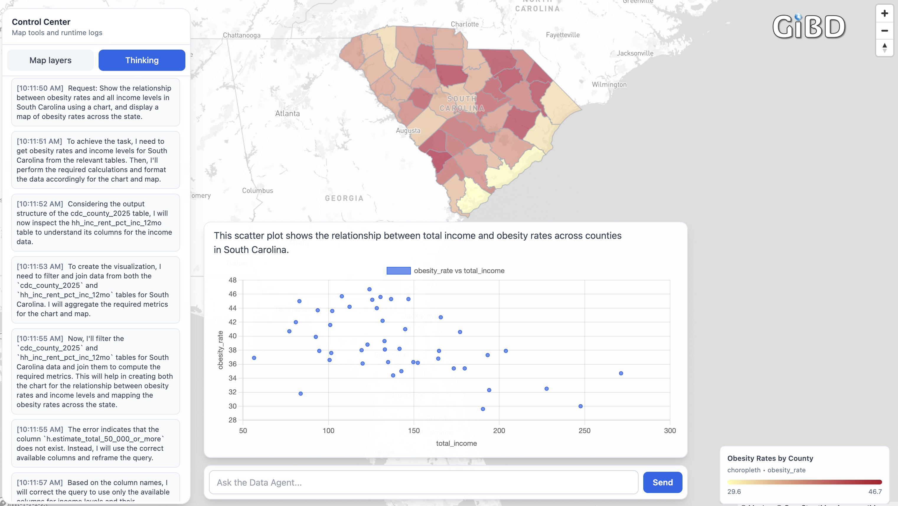
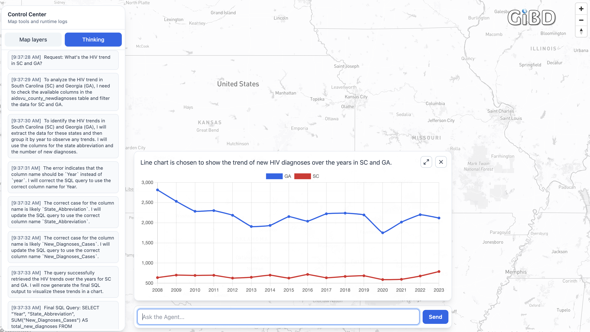
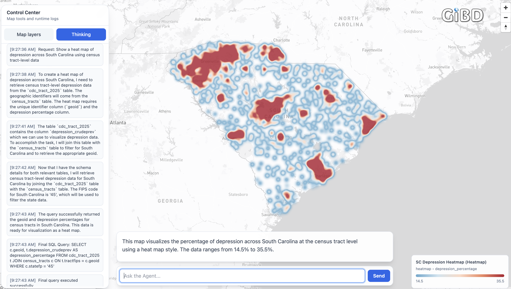
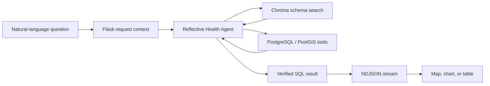

<div align="center">
  
  <h1>Health GIS Data Agent</h1>
  <p><strong>Ask a public-health question. Get grounded SQL, transparent reasoning, and an interactive geographic visualization.</strong></p>
  <p>
    A conversational geospatial analytics application that connects health, demographic, and boundary data through an autonomous text-to-SQL agent.
  </p>
  <p>
    
    
    
    
    
  </p>
</div>

---

## Overview

Health GIS Data Agent turns natural-language questions into reproducible health-data workflows. The agent discovers relevant database fields, verifies table schemas and values, tests generated SQL, and streams its progress to a light, shadcn/ui-inspired interface. Results are rendered as interactive maps, heatmaps, charts, or tables.

> [!NOTE]
> The interface follows the restrained spacing, typography, cards, borders, and blue accent language associated with shadcn/ui. The current frontend is a standalone Flask template built with Tailwind CSS-style utilities, Mapbox GL JS, and Chart.js; it does not require the React shadcn/ui package.

| Ask in natural language | Inspect the process | Explore the result |
| --- | --- | --- |
| Request health trends, spatial patterns, or relationships without writing SQL. | Follow schema discovery, value checking, SQL correction, and final execution in real time. | View county, tract, or state results as choropleths, heatmaps, charts, and tables. |

## Features

- **Conversational health analytics** — translate plain-English questions into executable PostgreSQL queries.
- **Reflective text-to-SQL workflow** — iteratively discover, inspect, test, correct, and execute.
- **Schema-aware retrieval** — use OpenAI embeddings and ChromaDB to find relevant fields from schema descriptions.
- **Database grounding** — verify real values and case-sensitive column names before producing the final query.
- **Geographic intelligence** — preserve canonical state, county, and census-tract GEOIDs for reliable mapping.
- **Multiple visual outputs** — generate choropleths, heatmaps, bar charts, line charts, scatter plots, pie charts, and tables.
- **Live reasoning stream** — deliver agent activity and results as newline-delimited JSON.
- **Fast boundary reuse** — cache state, county, and tract geometries in memory, serve compressed payloads, and persist them in browser IndexedDB.
- **Layer controls** — retain multiple map layers, toggle visibility, change basemaps, inspect legends, and remove layers.

## Example analyses

### County-level isolation and sleep disturbance

The agent joins a county-level segregation index with CDC PLACES health estimates, calculates the relationship between isolation and sleep disturbance, and renders the result as a nationwide county choropleth.


### Obesity and income in South Carolina

One request produces two coordinated outputs: a county choropleth of obesity prevalence and a scatter plot showing the relationship between obesity rates and total income across South Carolina counties.



### HIV diagnosis trends in South Carolina and Georgia

The agent identifies the correct case-sensitive year, state, and diagnosis fields, aggregates annual new diagnoses, and creates a two-series trend chart for 2008–2023.



### Census-tract depression heatmap

CDC PLACES tract estimates are joined to census-tract boundaries through canonical GEOIDs and visualized as a heatmap of depression prevalence across South Carolina.



## How it works



The agent operates in a bounded tool loop:

1. **Interpret** the question and infer the requested visualization and geographic level.
2. **Retrieve** semantically relevant schema fields from ChromaDB.
3. **Inspect** exact table metadata, including case-sensitive field names.
4. **Ground** requested place names and categorical values against the database.
5. **Test** candidate SQL and evaluate row counts, nulls, GEOIDs, and visualization requirements.
6. **Correct** the query using tool feedback.
7. **Execute** the final SQL and stream the resulting data to the interface.
8. **Visualize** the response by combining metric rows with cached boundary geometries when needed.

## Repository structure

```text
health-gis-data-agent/
├── app.py                    # Flask routes, streaming, and geometry payloads
├── database.py               # PostgreSQL connection and identifier handling
├── health_agent.py           # Reflective agent and database tools
├── schema_profiling.py       # Schema embedding and ChromaDB indexing
├── requirements.txt          # Python dependencies
├── static/
│   └── images/logo.png       # Application logo
├── templates/
│   └── index.html            # Light map-and-chart interface
└── docs/images/              # README example screenshots
```

## Supported data

The current agent prompt is configured for the following database groups:

| Domain | Example tables | Typical analyses |
| --- | --- | --- |
| CDC PLACES | `cdc_county_2025`, `cdc_tract_2025`, `cdc_zipcode_2025` | Obesity, depression, diabetes, sleep disturbance, and other health estimates |
| HIV surveillance | `aidsvu_county_newdiagnoses` | Annual diagnosis counts and rates by geography and demographic group |
| Demographics and socioeconomic conditions | `edu_attain_pop_25plus`, `employment_status`, `hh_inc_rent_pct_inc_12mo`, `hlthins_cov_chars_us` | Income, education, employment, housing burden, and insurance comparisons |
| Social and neighborhood context | `segregation_index`, `pubassist_inc_12mo_hh`, `means_of_transportation_to_work` | Segregation, public assistance, commuting, and health relationships |
| Geographic boundaries | `states`, `counties`, `census_tracts`, `block_groups` | State, county, tract, and block-group mapping and spatial joins |

## Quick start

### 1. Clone and install

```bash
git clone https://github.com/Autonomous-GIS/health-gis-data-agent.git
cd health-gis-data-agent

python -m venv .venv
source .venv/bin/activate
pip install -r requirements.txt
```

On Windows, activate the environment with:

```powershell
.venv\Scripts\activate
```

### 2. Configure the environment

Create a `.env` file in the project root:

```dotenv
OPENAI_API_KEY=your_openai_api_key

DB_HOST=localhost
DB_PORT=5432
DB_USER=your_database_user
DB_PASSWORD=your_database_password
DB_NAME=your_database_name
```

The PostgreSQL database should have PostGIS enabled and contain the health, demographic, and boundary tables referenced by the agent configuration.

### 3. Build the schema index

Create `schema.csv` in the project root with these columns:

```csv
Table,Column Name,Data Type,Description
```

Then index the complete schema:

```bash
python schema_profiling.py
```

To rebuild the index for one table during development:

```bash
python schema_profiling.py cdc_county_2025
```

This creates the local `chroma_db/` collection used by the agent's semantic schema-search tool.

### 4. Configure the map interface

Set the Mapbox public access token and frontend visualization model in the configuration section of `templates/index.html`:

```javascript
mapboxgl.accessToken = "your_public_mapbox_token";
const OPENAI_MODEL = "your_visualization_model";
```

> [!IMPORTANT]
> Do not place a private OpenAI API key in browser JavaScript for a public deployment. The current prototype contains a frontend model-call path for visualization decisions; route that request through a protected server endpoint before deployment.

### 5. Run the application

```bash
python app.py
```

Open [http://localhost:4042](http://localhost:4042) and ask a question such as:

```text
Show the relationship between obesity rates and income across South Carolina counties as a chart and a map.
```

## API

### Ask the agent

```http
POST /information
Content-Type: application/json
```

```json
{
  "question": "Show a heat map of depression across South Carolina using census tract data."
}
```

The endpoint responds as `application/x-ndjson`. Intermediate messages use `Type: "Log"`; the final item is returned as text, a map payload, or chart/table rows.

### Load cached boundaries

```http
GET /geometry-cache
Accept-Encoding: gzip
```

The response contains versioned state, county, and census-tract geometries indexed by GEOID. Clients that support gzip receive a compressed payload.

## Agent tools

| Tool | Purpose |
| --- | --- |
| `LOOKUP_SCHEMA` | Semantically search fields and descriptions in ChromaDB |
| `INSPECT_TABLE` | Retrieve exact field names and data types for a table |
| `CHECK_VALUE` | Confirm how a requested value is represented in the database |
| `TEST_SQL` | Execute a candidate read query and return previews and visualization warnings |
| `FINAL_ANSWER` | Execute the verified query and return the final dataframe |

## Design principles

- **Evidence before presentation** — test database queries before rendering polished outputs.
- **Transparent correction** — expose the agent's schema checks and SQL revisions to the user.
- **Canonical geography** — use full GEOIDs instead of partial state, county, or tract codes.
- **Separation of data and geometry** — return compact metric rows and join them to cached boundaries in the client.
- **Readable defaults** — use a light map, white cards, subtle borders, concise labels, and accessible blue actions.

## Production notes

Before exposing the application publicly, consider:

- Moving every OpenAI request behind the Flask server.
- Giving the application a dedicated read-only PostgreSQL role.
- Enforcing SQL parsing and statement-level allowlisting in addition to prompt instructions.
- Adding request authentication, rate limits, structured audit logs, and timeouts.
- Moving table descriptions from the system prompt into versioned configuration.
- Adding automated tests for GEOID handling, generated SQL, streaming, and visualization payloads.

## Contributing

Issues and pull requests are welcome.

---

<div align="center">
  <sub>Built for transparent, agent-driven public-health GIS analysis.</sub>
</div>
